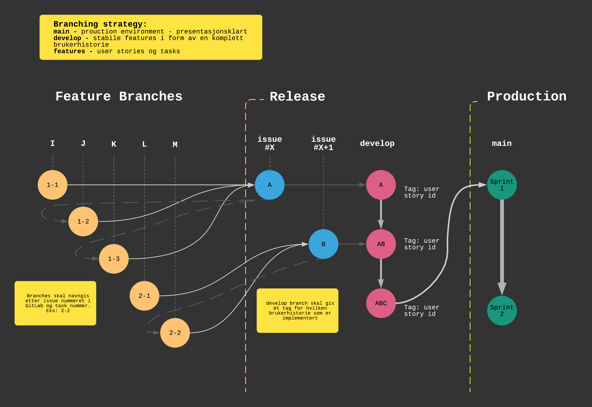

# Utviklingsprosessen
Utviklingsprosessen ble slått fast i [Leveranse 2]. Dette er et dokument som representerer avgjørelser tatt for denne innleveringen, men vil også oppdateres for å reflektere den nåværende prosessen for gruppen.

Mer informasjon kan finnes i repoets [README].


## GitLab
Gruppen bruker GitLab som Version Control System og har en del rutiner knyttet til dette. Inspirasjon for hvordan en Agil utviklingsprosess overføres til GitLab er tatt fra [denne GitLab] artikelen.

| Agile begrep    | GitLab feature       |
| --------------- | -------------------- |
| User story      | Issues               |
| Task            | Task list            |
| Epics / Phases  | Epic                 |
| Product backlog | Issue lists & labels |
| Sprint          | Milestones           |
| Kanban Board    | Issue boards         |

En User story kan ha tasks eller tech-stories under seg, som må implementeres for at brukerhistorien kan fullføres. Gruppen bruker GitLabs task lists.

Gruppen bruker faser for å organisere User Stories og utviklingen av produktet.

Resten av listen er forhåpentligvis selv-dokumenterende.

## Branching
En branchingstrategi som gruppen har blitt enig om vil bli fulgt. Diagrammet er basert på denne [Coding Garden videoen].



Branch I, J, [...], M er tasks som hører til en brukerhistorie. Det kan være fordelaktig å gjøre det på denne måten, slik at flere kan jobbe sammtidig på en brukerhistorie, da de kan være ganske store.
Grenene vil bli navngitt etter issue id (brukerhistorie) og tasknummer. 

Et eksempel, basert på [issue 5][1], vil være `5-1.1` for issue fem, task 1, subtask 1.

Når en task er ferdigstilt vil den merges inn i brukerhistorien (issue #X i diagrammet) og kun når en brukerhistorie er ferdig vil den merges inn i develop branchen. 

Når en sprint eller fase er over, passerer alle tester, blitt reviewed og testet av gruppens medlemmer vil den merges med main branchen. Dette er da en brukerhistorie som er klar for presentasjon til produkteier.

Det er viktig at en ny gren blir splittet av fra den grenen den skal merges inn i. Dette vises med stiplete grå linjer i diagrammet. Eksempelvis må grenen 1-3 splittes av fra gren A (issue #X).

## Utvikling
Hver oppgave skal på dette stadiet være et tenkt konkret stykke arbeid.
Dette arbeidet skal skje i en egen gren i git, og det skal skrives både tester og
eventuell dokumentasjon. Man trenger ikke dogmatisk følge testdrevet utvikling,
men all kode som skal inn i prosjektet skal ha enhetstester.

For hver oppgave har GitLab et forslag til gren-navn på formen
```
71-vurdere-om-vi-skal-kreve-oppgave-nummer-i-commitmessage
```
Denne blir fort litt lang, men så lenge issue nummer er med på starten
vil GitLab forstå at grenen hører til oppgaven når tiden er inne for merging.
I tillegg skal alle commits være navngitt deskriptivt etter reglene i
[conventional commits](https://www.conventionalcommits.org/en/v1.0.0/).
Dette vil si at alle commit messages er på formen
```
feat(#43): legge til statuslinje for nettverksoprasjoner

Beskrivelse av forandringen, kun dersom det trengs.
Inni parantesen skrives oppgavenummeret bunten jobber mot.
Merk at resten av linjen er i infinitiv, har liten forbokstav og er uten tegnsetting.
Linjen skal passe inn i setningen:
  
  Hvis denne commiten flettes inn i kodebasen vil den <melding>.
  
BREAKING CHANGES: ødelegger funksjonalitet og må derfor ha denne linjen
```
Commits med automatiske meldinger (`revert `, `merge `) trenger ikke følge reglene.

## Kanban-tavle
_Her må vi sammen gå igjennom regler._

## Testing
_Her må vi sammen gå igjennom regler._

## Språk
_Her må vi sammen gå igjennom regler._

Jeg foreslår å holde git-terminologi på engelsk, samt variabelnavn og kommentarer. Dokumentasjon, wiki og .md dokumenter vil være på norsk.

[denne GitLab]: https://about.gitlab.com/blog/2018/03/05/gitlab-for-agile-software-development/
[Leveranse 2]: rapporter/L2/L2_TDT4140_Programvareutvikling.pdf
[README]: README.md
[Coding Garden videoen]: https://youtu.be/Lj_jAFwofLs
[1]: https://gitlab.stud.idi.ntnu.no/tdt4140/landsby-3/gruppe-40/middagsdeling/-/issues/5
