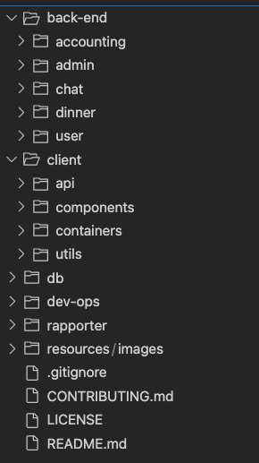

# Intro

Dette er mappeevaluering for gruppe 40 i faget TDT4140 Programvareutvikling, våren 2021.

## Gruppen består av:
* Ivar Carlsen, ivarhc@stud.ntnu.no
* Marius Arhaug, mariuhar@stud.ntnu.no
* Karen Hompland, karenhom@stud.ntnu.no
* Lars Tønder, larstond@stud.ntnu.no
* Eskild G. Hansen, eskildha@stud.ntnu.no
* Torunn Elisabeth Seyffarth, torunnse@stud.ntnu.no
* Joakim Schäffer, jnschaff@stud.ntnu.no

og veileder
* Sindre Langaard

# NAVN Overordnet oversikt
Gruppen har blitt hyret inn for å lage en Middagsdelingstjeneste ved navn NAVN. Tjenesten skal gjøre det enkelt for brukere, som synes det er kjedelig å lage middag kun til seg selv, å tilby middager til andre brukere. Brukere kan så samles og spise et bedre måltid sammen og kanskje på sikt utvide sitt eget nettverk og få litt sosialt påfyll.

## Produktoversikt
For å få et minimal viable project (MVP) opp å gå, må ulike tjenester være på plass. Her presenteres en oversikt over de tjenestene og prosessene som trengs.

### Web-applikasjon
Dette er inngangspunktet til NAVN. Her vil brukere kunne administrere middager de vil holde, melde seg opp til middager og ha en oversikt over tilgjengelige middager. Brukeren må også kunne filtrere middager samt å kunne kommunisere med andre brukere.

For å få til dette må det eksistere en **User Manager** som håndterer funksjonaliteten til brukeren, samt sørger for å legge det til i MySQL-databasen som vil bli brukt. Det trengs også en **Chat Manager**, som håndterer kommunikasjonen mellom brukere, samt en **Dinner Manager** som håndterer funksjonaliteten til selve middagsarrangementet.

### User Manager
Denne tjenesten vil håndtere all funksjonalitet relatert til brukeren. Eksempler på dette vil være å lage/oppdatere brukerdata, lagre brukerdata, håndtere brukerrating og reputation.

### Chat Manager
Denne tjenesten vil håndtere all funksjonalitet relatert til kommunikasjon mellom brukere. Eksempler på dette er å opprette en en-til-en, en-til-flere og middagschat, samt å lagre meldinger, vedlegg og chat-rooms.

### Dinner Manager
Denne tjenesten vil håndtere all funksjonalitet relatert til et middagsarrangement. Eksempler på dette er å opprette/redigere middager, lagre middager, arkivere middager, og lignende.

### Accounting Manager
Denne tjenesten vil håndtere all funksjonalitet relatert til utgifter ved middagen. Eksempler på dette er å dele utgiftene på deltagerne og på sikt ha en Vipps-integrasjon.

### Admin Manager
Denne tjenesten vil håndtere all funksjonalitet relatert til administrasjon av produktet. Eksempler på dette er å slette eller endre brukere, administrere middager og chat.

___

Dette blir til sammen seks programvarer som vil snakke sammen for å lage et helhetlig produkt. Alle tjenestene vil måtte ha en intern arkitektur som vil sørge for at programmet passer inn i helheten.

## Produktarkitektur
Figuren viser et veldig overordnet bilde av prosessene som er beskrevet i seksjonen over. Dette gir et klart bilde over hva vi trenger og danner grunnlaget for utviklingsplanen.

Følgende seksjoner utvider figuren og går gjennom avhengigheter mellom systemene. De vil bli tatt for seg i rangert rekkefølge, der færre avhengigheter rangeres høyere.

### MySQL database
Databasen har ingen avhengigheter, men mange de fleste tjenestene er avhengig av den. Databasen sørger for lagring av all data gjennom schemas. Databasen har ingen annen funksjonalitet for andre tjenester enn å presentere dataen som de andre tjenestene trenger.

### User Manager
Brukertjenesten er ansvarlig for å identifisere brukeren som ønsker å være med på en middag eller å organisere en middag, eller kommunikasjon. Dinner Manager, Chat Manager og Admin Manager er derfor alle avhengig av User Manager, eller hvertfall deler av den (dette vil presiseres tydligere når de ulike programmene får sin egen arkitektur). 

### Dinner Manager
Middagen vil være avhengig av brukertjenesten og vil kun ha Accounting Manager som avhenger av seg.

### Chat Manager
Chat Manager er avhengig av Dinner Manager og User Manager. 

### Accounting Manager
Er avhengig av Dinner Manager for å kunne utføre sin funksjon som er spleising av middagen.

### Admin Manager
En admin er en vanlig bruker, med utvidet funksjonalitet. Den er derfor avhengig av User Manager, men må også ha tilgang til middagsarrangementer.

### REST og Socket API
Gruppen er klar over at deler av appen må opperere i real-time. Dette kan gjøres gjennom en Socket API som for eksempel håndterer chatfunksjonalitet. Det er derimot enda ikke helt klart om det ønskes en REST API eller om bare hele appen vil kunne gjøres real-time. Dette avhenger av hvor mye tid som ønskes brukt på denne funksjonen, og hvor komplekst de to ulike APIene er å implementere.

### Prosjektets kodearkitektur
Her følger en figur som presenterer hvordan gruppen ser for seg å strukturere kodebasen.

## Utviklingsfaser
Gruppen blir å bruke en smidig tilnærming til utvikling og har tatt sikte på seks utviklingssykluser (Sprints), på to uker hver. Utviklingen vil også gjøres i flere faser. En fase kan ta en eller flere sprints å implementere, og de vil variere i størrelse.

Fasene trenger ikke å strengt følge hverandre. Som eksempel kan fase 2 og 3 gjennomføres samtidig.

Foreløpig ser gruppen for seg følgende faser:

### Fase 0: Forstudie, teknisk arkitektur og teknologi-stack oppsett.
Dette er en planleggingsfase hvor high-level teknisk planlegging vil bli gjort. Det må etableres hvordan prosjektet vil bli deployed, releaseplan, testplan, tech-stack, prosjektstandarder og hvordan kildekoden struktureres. 

Litt mer spesefikt må det etableres hvordan de ulike delene kommuniserer med hverandre for å få til et helhetlig produkt som produkteier kan være fornøyd med og gruppen kan være stolt av. Det må finnes en struktur som gjør at Testdriven development (TDD) kan tilrettelegges.

Dette er fasen som pågår nå, som f.eks dette dokumentet er en del av. 

Denne fasen vil konkluderes når det foreligger en detaljert plan for den overordnede arkitekturen, tech-stack samt deployment.

### Fase 1: Internt teknisk planlegging og datalagringstruktur.
Denne fasen vil fastslå strukturen på databasen og intern arkitektur for de ulike programvarene nevnt over. Her vil all funksjonalitet planlegges og flyten av data mellom tjenestene fastsettes. Når dette er fastsatt vil det bestemmes hvilke properties som kan være nyttig å ha i produktet (altså hva som skal lagres og hvordan databasen implementeres).

Suksess og ferdigstilling i/av denne fasen betyr at de ulike programvarene er brutt ned og planlagt, og det foreligger en tydelig modell for databasen. Dette vil danne et godt grunnlag for å se om det er hull i prosjektet. 

### Fase 2: Dummydata og utviklingsforberedelser.
I denne fasen vil gruppen generere falsk data (brukere og middager) som gjør testing enklere når utvikling først starter. Databasemodellene som fastsettes i fase 1 vil danne grunnlaget for denne dataen. 

Denne fasen vil gi et tydelig bilde av datalagring og skinne et lys på potensielle mangler i databasestrukturen. 

Fasen regnes som konkludert når det foreligger en database med nok informasjon til å grundig teste utviklingen når den starter.

### Fase 3: Brukergrensesnittdesign.
Her vil brukergrensesnittet utarbeides og en prototype vil fremlegges. 

En produktlogo og et produktnavn vil også fastslås her.

Denne fasen anses ferdigstilt når gruppen i sammarbeid med produkteier har kommet frem til et grensesnitt som tilfredsstiller funksjonaliteten fastsatt i fase 1, og som alle er fornøyd med.

### Veien videre
En smidig prosess planlegger ikke lengre frem i tid en nødvendig, og etter fase 3 er det vanskelig å gi en prioritering av hva som kommer i fase 4 og utover.

Det er enda ikke skrevet en eneste linje kode, men gruppen har tilrettelagt for at utviklingsprosessen er så tydelig og klar som mulig.